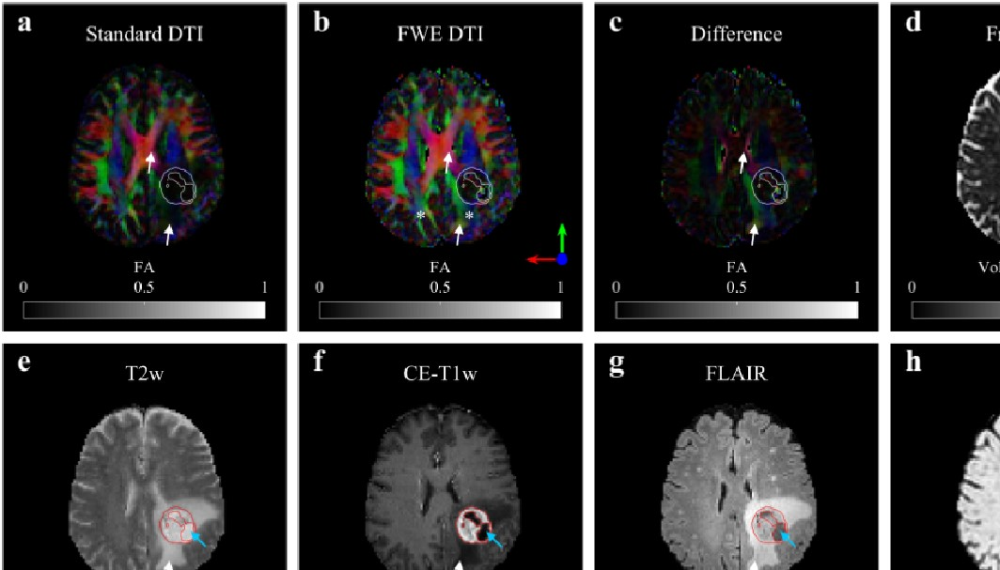
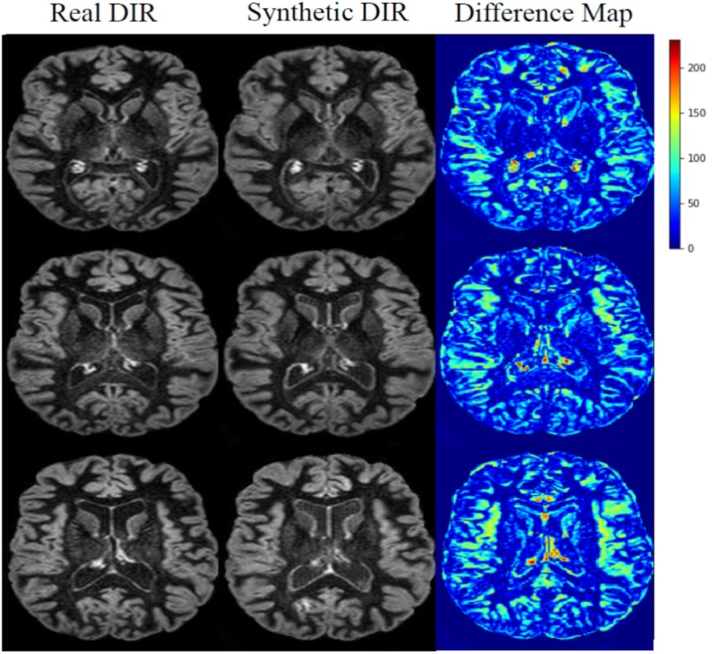

## Welcome

**Computational Imaging** is an interdisciplinary working group between [TUM Neuroradiology](http://www.neurokopfzentrum.med.tum.de/neuroradiologie/) and [Image-Based Biomedical Modeling](http://ibbm.in.tum.de/WebHome), jointly headed by Dr. Benedikt Wiestler and Prof. Bjoern Menze.

Medical Imaging generates a plethora of data, of which today only a fraction is used for clinical decision making. Within our Working Group, we aim to develop algorithms and strategies to make the wealth of information accessible to clinicians. To this end, we are developing tools for (un)supervised lesion detection / segmentation, classification and data integration. Together with our clinical partners @ TUM, our current focus is on two neurological model diseases: Multiple Sclerosis and Gliomas. To support dissemination and use of our results, we aim to make all tools developed by us available here. We are also actively contributing to important challenges ([BRATS](https://www.med.upenn.edu/sbia/brats2018.html)) and workshops ([BrainLes](http://www.brainlesion-workshop.org/)) in the field of medical image computing.

## News
- Tom Finck receives a TUM-KKF scholarship
- Marie Metz wins a Trainee Research Award Neuroradiology @ RSNA 2019 for her work "Predicting Glioblastoma Recurrence from Preoperative MR Scans using Fractional Anisotropy Maps with Free Water Suppression"
- Benedikt Wiestler is awarded the 2019 Kurt-Decker-Preis @ DGNR
- Our proposal "Predicting individual disease activity in Multiple Sclerosis: Making the informative wealth of white matter lesion imaging clinically accessible" is selected to be funded in the DFG Priority Programme *Radiomics*

## People
### Group Leaders
- Dr. Benedikt Wiestler (TUM Neuroradiology)
- Prof. Bjoern Menze (TUM IBBM)

### Scientists
- Dr. Paul Eichinger (TUM Neuroradiology)
- Dr. Tom Finck (TUM Neuroradiology)
- Dr. Nikhil Sasidharan (MD Student)
- Christoph Baur (PhD Student)
- Florian Kofler (PhD Student)
- Hongwei Li (PhD Student)
- Timo Loehr (PhD Student)
- Marie Metz (MD Student)

### Collaboration Partners
- Dr. Shadi Albarqouni (TUM CAMP / ETH Zurich)
- Prof. Stephanie Combs (TUM RadioOncology)
- PD Jens Gempt (TUM Neurosurgery)
- Prof. Jan Kirschke (TUM Neuroradiology)
- Prof. Mark Mühlau (TUM Neurology)
- Prof. Nassir Navab (TUM CAMP)
- Dr. Franz Pfister (Digital Helix GmbH)
- Dr. Viola Pongratz (TUM Neurology)
- Prof. Alexander Radbruch (Heidelberg / Essen Neuroradiology)
- Prof. Jürgen Schlegel (TUM Neuropathology)
- Dr. Christian Wachinger (LMU Artificial Intelligence in Medical Imaging)
- Prof. R. Wiest (Bern Neuroradiology)

## Selected Projects
<table>
  <tbody>
    <tr>
      <td></td>
      <td></td>
    </tr>
   <tr>
      <td></td>
      <td></td>
    </tr>
   <tr>
      <td></td>
      <td></td>
    </tr>
  </tbody>
</table>

## Selected Publications

**Li H**, Paetzold J, Sekuboyina A, **Kofler F**, Zhang J, Kirschke JS, **Wiestler B**, **Menze BH**. [DiamondGAN: Unified Multi-Modal Generative Adversarial Networks for MRI Sequences Synthesis](https://arxiv.org/abs/1904.12894). MICCAI, 2019

**Baur C**, **Wiestler B**, Albarqouni S, Navab N. [Fusing Unsupervised and Supervised Deep Learning for White Matter Lesion Segmentation](http://proceedings.mlr.press/v102/baur19a.html). MIDL, 2019

**Eichinger P**, Schön S, Pongratz V, Wiestler H, **Zhang H**, Bussas M, Hoshi MM, Kirschke JS, Berthele A, Zimmer C, Hemmer B, Mühlau M, **Wiestler B**. [Accuracy of Unenhanced MRI in the Detection of New Brain Lesions in Multiple Sclerosis](https://www.ncbi.nlm.nih.gov/pubmed/30860448). Radiology, 2019

**Lipkova J**, Angelikopoulos P, Wu S, **Alberts E**, **Wiestler B**, Diehl C, Preibisch C, Pyka T, Combs S, Hadjidoukas P, Van Leemput K, Koumoutsakos P, Lowengrub JS, **Menze BH**. [Personalized Radiotherapy Design for Glioblastoma: Integrating Mathematical Tumor Models, Multimodal Scans and Bayesian Inference](https://ieeexplore.ieee.org/document/8654016). IEEE TMI, 2019

**Molina-Romero M**, **Wiestler B**, Gómez PA, Menzel MI, **Menze BH**. [Deep Learning with Synthetic Diffusion MRI Data for Free-Water Elimination in Glioblastoma Cases](https://link.springer.com/chapter/10.1007/978-3-030-00931-1_12). MICCAI, 2018

**Zhang H**, **Alberts E**, Pongratz V, Mühlau M, Zimmer C, **Wiestler B**, **Eichinger P**. [Predicting conversion from clinically isolated syndrome to multiple sclerosis–An imaging-based machine learning approach](https://www.sciencedirect.com/science/article/pii/S2213158218303413). NeuroImage: Clinical, 2018

Baur C, **Wiestler B**, Albarqouni S, Navab N. [Deep Autoencoding Models for Unsupervised Anomaly Segmentation in Brain MR Images](https://arxiv.org/abs/1804.04488). arXiv:1804.04488, 2018

**Eichinger P**, Wiestler H, **Zhang H**, Biberacher V, Kirschke JS, Zimmer C, Mühlau M, **Wiestler B**. [A novel imaging technique for better detecting new lesions in multiple sclerosis](https://www.ncbi.nlm.nih.gov/pubmed/28756606). J Neurol, 2017

**Eichinger P**, **Alberts E**, Delbridge C, Trebeschi S, Valentinitsch A, Bette S, Huber T, Gempt J, Meyer B, Schlegel J, Zimmer C, Kirschke JS, **Menze BH**, **Wiestler B**. [Diffusion tensor image features predict IDH genotype in newly diagnosed WHO grade II/III gliomas](https://www.nature.com/articles/s41598-017-13679-4). Scientific Reports, 2017

**Alberts E**, Tetteh G, Trebeschi S, Bieth M, Valentinitsch A, **Wiestler B**, Zimmer C, **Menze BH**. [Multi-modal Image Classification Using Low-Dimensional Texture Features for Genomic Brain Tumor Recognition](https://link.springer.com/chapter/10.1007/978-3-319-67675-3_18). MICGen @ MICCAI 2017

**Menze BH**, Van Leemput K, Lashkari D, Riklin-Raviv T, Geremia E, Alberts E, Gruber P, Wegener S, Weber MA, Székely G, Ayache N, Golland P. [A Generative Probabilistic Model and Discriminative Extensions for Brain Lesion Segmentation - With Application to Tumor and Stroke](https://www.ncbi.nlm.nih.gov/pubmed/26599702). IEEE Trans. Med. Imaging, 2016

Osswald M, Jung E, Sahm F, Solecki G, Venkataramani V, Blaes J, Weil S, Horstmann H, **Wiestler B**, Syed M, Huang L, Ratliff M, Karimian Jazi K, Kurz FT, Schmenger T, Lemke D, Gömmel M, Pauli M, Liao Y, Häring P, Pusch S, Herl V, Steinhäuser C, Krunic D, Jarahian M, Miletic H, Berghoff AS, Griesbeck O, Kalamakis G, Garaschuk O, Preusser M, Weiss S, Liu H, Heiland S, Platten M, Huber PE, Kuner T, von Deimling A, Wick W, Winkler F. [Brain tumour cells interconnect to a functional and resistant network](https://www.ncbi.nlm.nih.gov/pubmed/26536111). Nature, 2015

**Menze BH**, Jakab A, Bauer S, Kalpathy-Cramer J, Farahani K, Kirby J, Burren Y, Porz N, Slotboom J, Wiest R, Lanczi L, Gerstner E, Weber MA, Arbel T, Avants BB, Ayache N, Buendia P, Collins DL, Cordier N, Corso JJ, Criminisi A, Das T, Delingette H, Demiralp Ç, Durst CR, Dojat M, Doyle S, Festa J, Forbes F, Geremia E, Glocker B, Golland P, Guo X, Hamamci A, Iftekharuddin KM, Jena R, John NM, Konukoglu E, Lashkari D, Mariz JA, Meier R, Pereira S, Precup D, Price SJ, Raviv TR, Reza SM, Ryan M, Sarikaya D, Schwartz L, Shin HC, Shotton J, Silva CA, Sousa N, Subbanna NK, Szekely G, Taylor TJ, Thomas OM, Tustison NJ, Unal G, Vasseur F, Wintermark M, Ye DH, Zhao L, Zhao B, Zikic D, Prastawa M, Reyes M, Van Leemput K. [The Multimodal Brain Tumor Image Segmentation Benchmark (BRATS)](https://www.ncbi.nlm.nih.gov/pubmed/25494501). IEEE Trans. Med. Imaging, 2015

## Funding

We are supported by the [SFB-824](http://www.sfb824.de/de/index.php), [Deutsche Krebshilfe](https://www.krebshilfe.de/), [TUM-KKF](http://www.med.tum.de/de/fakult%C3%A4tsinterne-f%C3%B6rderung-kkf), [ZD.B](https://zentrum-digitalisierung.bayern/) and [DFG](https://www.uniklinik-freiburg.de/radiomics.html).
